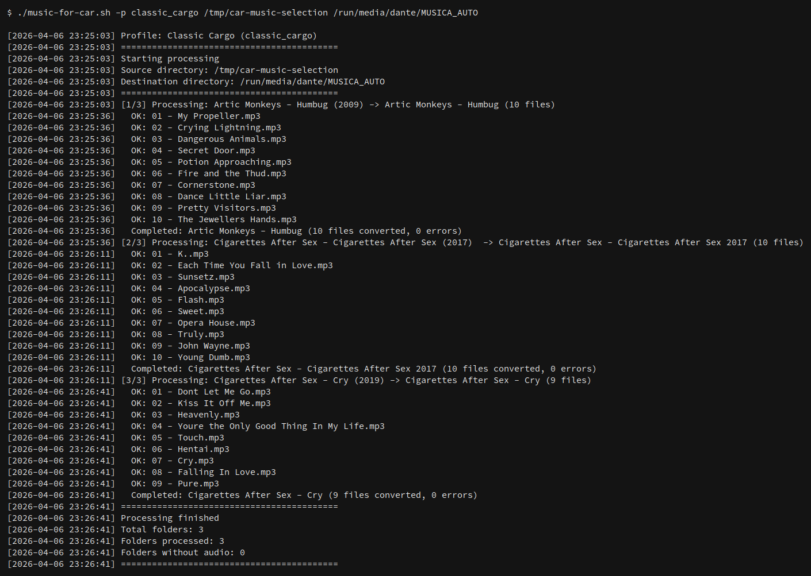
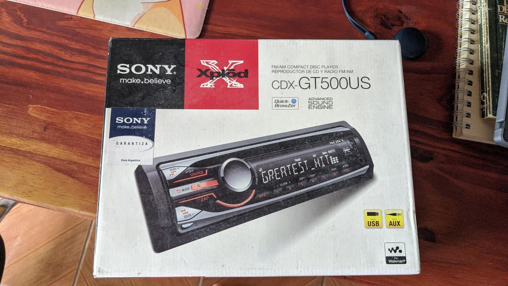

# music-for-car.sh

Bash script to convert audio files from any format to MP3 optimized for car USB drives.



## Purpose & Context

This script started as a personal tool — I built it through trial and error for my own setup: an old **Sony CDX-GT500US** head unit and a pair of 4-inch car speakers. After a lot of tweaking, I landed on settings that give me clean sound with no distortion, no weird noises, no speaker vibrations, decent load times, and a solid space saving compared to FLAC.

I decided to share it publicly, documenting every decision I made and adding a profile system so others can adapt it to their own hardware.

These defaults are tuned for my specific car. They may not be ideal for yours — treat this as a starting point you can customize, not a universal prescription.



## What it does

- **Converts** all audio (FLAC, OGG, OPUS, M4A, WAV, AAC, WMA) to **MP3 CBR**
- **Normalizes** volume with `loudnorm` (two-pass by default, single-pass optional)
- **Highpass** filter to eliminate rumble that car speakers can't reproduce
- **Sanitizes** folder and file names to pure ASCII (no accents, no weird symbols)
- **Cleans** ID3 metadata: keeps only title, artist, album, track
- **Audio only**: discards cover images, .lrc files, and anything non-audio

## Requirements

- `ffmpeg` (with libmp3lame)
- `ffprobe` (ships with ffmpeg)
- `iconv`
- `fatsort` (to physically sort the USB drive after copying)

## Usage

```bash
./music-for-car.sh [-p profile] <source_dir> <dest_dir>
```

### Default profile

```bash
./music-for-car.sh ~/Music ~/mp3_para_auto
```

### With a specific profile

```bash
./music-for-car.sh -p classic_cargo ~/Music ~/mp3_para_auto
```

### Single album

```bash
./music-for-car.sh ~/Music/"Band - Album (2015)" ~/mp3_para_auto
```

### List available profiles

```bash
./music-for-car.sh
```

## Profiles

Profiles live in `profiles/*.conf`. They are simple shell-compatible config files — `#` for comments, `KEY="value"` for settings.

### Creating a custom profile

Copy an existing profile and modify:

```bash
cp profiles/default.conf profiles/my_car.conf
```

Then use it:

```bash
./music-for-car.sh -p my_car ~/Music ~/mp3_para_auto
```

### Config options

| Key | Default | Description |
|---|---|---|
| `PROFILE_NAME` | `"Default"` | Human-readable name, shown in logs |
| `HIGHPASS_FREQ` | `"100"` | Highpass filter frequency in Hz. Set to `0` to disable |
| `LOUDNORM_I` | `"-16"` | Integrated loudness target (LUFS) |
| `LOUDNORM_TP` | `"-1.5"` | True peak limit (dBTP) |
| `LOUDNORM_LRA` | `"11"` | Loudness range target (LU) |
| `BITRATE` | `"256k"` | MP3 bitrate |
| `SAMPLE_RATE` | `"44100"` | Output sample rate in Hz |
| `FFMPEG_THREADS` | `"0"` | ffmpeg thread count (`0` = auto-detect) |
| `FAST_LOUDNORM` | `"false"` | Use single-pass loudnorm (faster, less accurate) |
| `PARALLEL` | `"false"` | Process files within each album in parallel |

### Included profiles

- **`default`** — Generic starting point. Two-pass loudnorm, sequential processing.
- **`classic_cargo`** — Tuned for Sony CDX-GT500US + 4" speakers. Two-pass loudnorm, parallel processing, multi-threaded ffmpeg.

## Understanding the audio settings

### MP3 CBR

Constant bitrate is more compatible with older car stereo decoders than VBR. 256kbps is transparent for most listeners and saves ~4-5x space vs FLAC.

**When to change:**
- Lower to `192k` if USB space is tight (still good quality)
- Raise to `320k` if you have premium speakers and can hear the difference

### Highpass filter

Car speakers — especially small ones (4" or less) — can't reproduce frequencies below ~80-100 Hz. Those frequencies just waste bitrate and can cause distortion.

**When to change:**
- Set to `0` (disabled) if your car has a proper subwoofer
- Lower to `80` if your speakers handle lows better
- Raise to `120` if you have very small speakers (3" or less)

### Loudnorm (EBU R128 normalization)

Every album is mastered at a different level. Without normalization, you constantly adjust volume between tracks. `loudnorm` measures and corrects loudness so everything plays at the same perceived volume.

**Two-pass** (default): measures each file first, then applies precise correction. Best quality.
**Single-pass** (`FAST_LOUDNORM="true"`): estimates and applies in one go. ~2x faster, slightly less accurate.

**When to change:**
- `LOUDNORM_I`: `-16` is streaming standard. Use `-14` for louder playback, `-20` for more dynamic range
- `LOUDNORM_LRA`: `11` preserves dynamics. Lower to `7` for more consistent loudness (pop/EDM), raise to `15` for classical/jazz
- `LOUDNORM_TP`: `-1.5` prevents clipping. Don't raise above `-1.0`

### Parallel processing

When `PARALLEL="true"`, all files in an album are converted simultaneously using background processes. Combined with `FFMPEG_THREADS="0"` (auto), this uses all your CPU cores.

**When to use:**
- Enable for fast machines with lots of RAM
- Disable if you're memory-constrained or processing very large FLAC files

### fatsort

Car stereos read files in the physical order they appear in the FAT directory table, **not** alphabetically. `fatsort` physically reorders the entries so the stereo reads them correctly.

## Full USB drive workflow

### 1. Process the music

```bash
./music-for-car.sh -p classic_cargo ~/Music ~/mp3_para_auto
```

### 2. Format the USB drive as FAT32

```bash
# Verify the correct device with lsblk
lsblk

# Unmount
sudo umount /dev/sdX1

# Format
sudo mkfs.vfat -F 32 -n "CAR_MUSIC" /dev/sdX1
```

### 3. Copy the files

```bash
# Mount
sudo mount /dev/sdX1 /run/media/dante/CAR_MUSIC

# Copy
cp -r ~/mp3_para_auto/* /run/media/dante/CAR_MUSIC/
```

### 4. Sort with fatsort (CRUCIAL)

```bash
# Unmount first (fatsort requires the device to be unmounted)
sudo umount /run/media/dante/CAR_MUSIC

# Sort
sudo fatsort /dev/sdX1

# Remount
sudo mount /dev/sdX1 /run/media/dante/CAR_MUSIC
```

### 5. Unmount and use

```bash
sudo umount /run/media/dante/CAR_MUSIC
```

## Expected folder format

The script expects the source directory to contain albums formatted as:

```
Band - Album Name (Year)/
  01 - Song.flac
  02 - Song.flac
  cover.jpg
```

The `(Year)` at the end is optional. Everything else is parsed as `Band` and `Album`.

## Output format

### Folders

- `Band - Album Name`

### Files

- `01 - Song Name.mp3`
- `02 - Another Song.mp3`

All names are pure ASCII: no accents, no ñ, no quotes, no parentheses.

### ID3v2.3 Metadata

Only includes: `title`, `artist`, `album`, `track`. Everything else is stripped (embedded images, comments, encoder info, etc.).

## Considerations

- FAT32 has a 4GB per-file limit (not relevant for MP3)
- Don't exceed ~500-600 files per folder to avoid issues with older stereos
- Keep a single directory level (album folders, no subfolders)
- File/folder names max 64 characters for compatibility
- If files are added or removed in the future, re-run `fatsort`

## Log

Each run generates a `processing.log` in the script's directory (overwritten each run).

## License

MIT License — free to use, modify, and distribute. See [LICENSE](LICENSE) for details.
